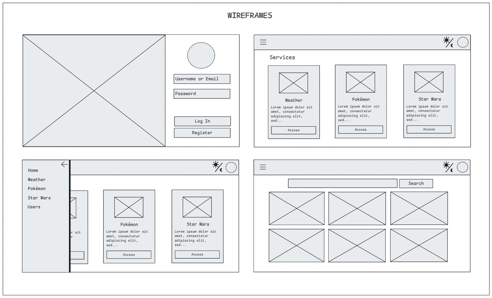

# GDASH CHALLENGE

## DESCRIPTION

The objective is to develop a full-stack application that consumes a public API to retrieve weather information based on the user's location, also Star Wars and Pokémon APIs integration. It follows best practices and principles of Event-Driven Architecture and Microservices.

## SYSTEM DESIGN


## WIREFRAMES



## PROJECT STRUCTURE

```bash
.
├── docs/
├── frontend/
├── backend/
│   ├── api-gateway/
│   ├── user-api/
│   └── weather-api/
├── workers/
│   ├── weather-pub-worker/
│   └── weather-sub-worker/
└── infra/
```