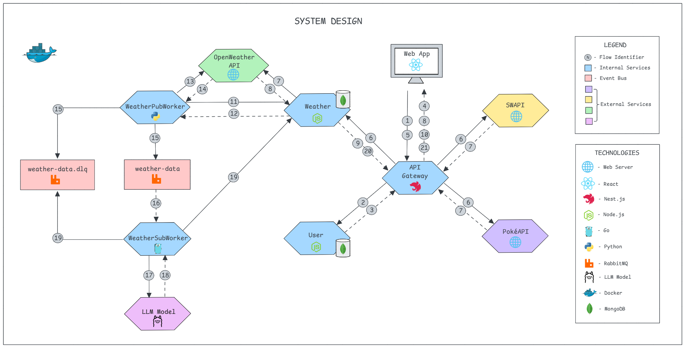

# GDASH CHALLENGE

## DESCRIPTION

The objective is to develop a full-stack application that consumes a public API to retrieve weather information based on the user's location. It follows best practices and principles of Event-Driven Architecture and Microservices. Below, you can see the system design.

## FOLDER STRUCTURE

.
├── docs/
│   └── digrams/
├── frontend/
│   ├── src/
│   │   └── main.ts
│   ├── config/
│   │   └── .env
│   └── Dockerfile
├── backend/
│   ├── api-gateway/
│   │   ├── src/
│   │   │   └── main.ts
│   │   ├── config/
│   │   │   └── .env
│   │   └── Dockerfile
│   ├── user-api/
│   │   ├── src/
│   │   │   └── main.js
│   │   ├── config/
│   │   │   └── .env
│   │   └── Dockerfile
│   └── weather-api/
│       ├── src/
│       │   └── main.js
│       ├── config/
│       │   └── .env
│       └── Dockerfile
├── workers/
│   ├── weather-pub-worker/
│   │   ├── src/
│   │   │   └── main.py
│   │   ├── config/
│   │   │   └── .env
│   │   └── Dockerfile
│   └── weather-sub-worker/
│       ├── src/
│       │   └── main.go
│       ├── config/
│       │   └── .env
│       └── Dockerfile
└── docker-compose.yml